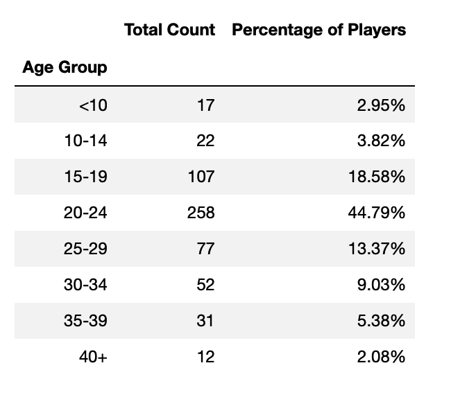
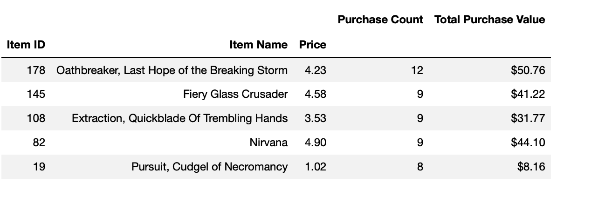
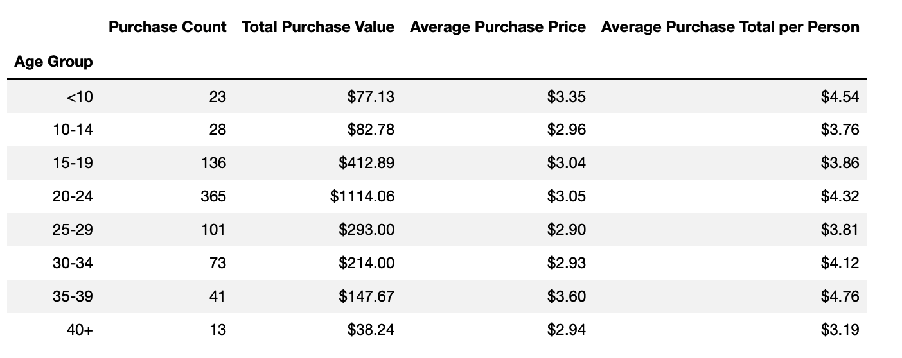

# Pandas Challenge

The purpose of this project is to analyze the purchasing data for the game Heroes of Pymoli. 

The analysis has included the following:

- Player Count

- Purchasing Analysis (Total)

- Gender Demographics

- Purchasing Analysis (Gender)

- Age Demographics

- Top Spenders

- Most Popular Items

- Most Profitable Items

Here are some visualizations:

